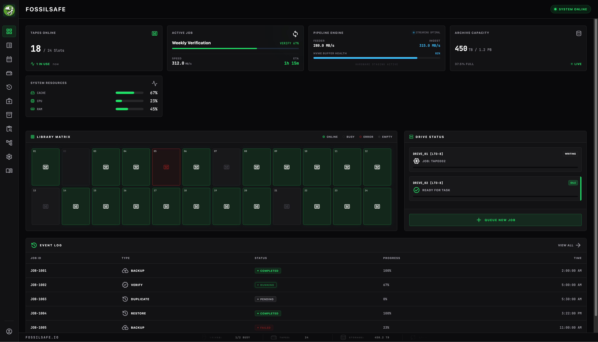

<div align="center">
  
  <br />
  
  <br />
  <sub><a href="https://fossilsafe.io">more screenshots available here</a></sub>
</div>
# FossilSafe

> ⚠️ **Project Status: Alpha**
> FossilSafe is under active development. Core functionality works, but the project is still evolving and some features may be incomplete or change as development continues. USE AT YOUR OWN RISK.

FossilSafe is an open-source tool for managing LTO tape backups with a focus on simple, reliable archival workflows. It is designed for homelabs, studios, and small organizations that need a practical way to back up essential data securely to tape.
Unlike traditional backup suites, FossilSafe focuses on simple, transparent tape workflows built around LTFS and standard Linux tools.

## Why FossilSafe Exists

FossilSafe was built to bring the reliability of tape storage formats like LTFS to users who do not require the overhead of legacy enterprise suites. It provides a straightforward appliance experience—managing jobs, formatting media, streaming parallel writes, and maintaining long-term hardware-independent archives from a single host.

## ⭐ Key Features

- **🔒 Catalog-Independent Disaster Recovery**: Tapes are self-describing and cryptographically signed (Ed25519) with an embedded JSON catalog. You can reconstruct your database and recover your data even if the FossilSafe appliance is lost.
- **💾 Multi-Source Backup**: Backup from SMB/CIFS, NFS, Local, SFTP/SSH, and S3-compatible sources directly to LTO tape.
- **🛡️ Hardware-Independent Encryption**: AES-256 encryption via GPG, ensuring you can read your tapes on any Debian 12 system without proprietary hardware.
- **📼 Advanced Tape Operations**: Support for tape spanning (`--multi-volume`), LTFS formatting, full `mtx` integration for tape changers, and drive-only mode for single standalone drives. Includes parallel drive operations and interactive drive path calibration.
- **👥 Role-Based Access**: Simple multi-user access with Admin, Operator, or Viewer roles. Supports Two-Factor Authentication (TOTP) and API Keys.
- **⚡ High-Performance Streaming Pipeline**: NVMe staging and multi-drive parallelism to keep tapes streaming efficiently, utilizing dual-threaded staging buffers and real-time IO telemetry.
- **🗂️ Intelligent Archival Policies**: Policy-driven source deletion after successful backup verification to free up network storage securely.
- **🔍 Restoration Wizard**: Guided file recovery workflow with full-text search across the catalog, selective restores, and multi-tape restore prompts.
- **⏰ Job Scheduling**: Cron-based scheduling with concurrent job execution and automatic retries.
- **📊 Incremental Backups**: File-level change detection and deduplication awareness to minimize tape usage for unchanged files.
- **🔧 System Diagnostics & Monitoring**: Predictive health monitoring (TapeAlerts via SCSI logs) and Prometheus metrics endpoints.
- **📝 Observability**: Searchable JSON structured logs, WebSocket log streaming, and verifiable audit trails.
- **🔔 Notification System**: Webhook and email reporting, plus custom pre-backup and post-backup scripts (consistency hooks).
- **🖥️ Modern Interface**: A web-based UI for managing jobs, tapes, and restores with an interactive onboarding setup.

## Project Status

FossilSafe is actively developed. Many core features are stable and usable today, while others are still being refined and expanded. As a project maintained by a solo developer, hardware compatibility support is continually broadening. 

Feedback, hardware compatibility reports, and real-world testing are extremely valuable as the project evolves.

## Installation

You can install FossilSafe on a single Debian 12 host. Clone the repository and run the installer:

```bash
git clone https://github.com/FOSSILSAFE/FOSSIL-SAFE.git
cd FOSSIL-SAFE/scripts
sudo ./install.sh
```

After installation, the web interface will be available at `http://<host>:8080`.

## Documentation

For more detailed technical information and practical guidance, please check the `docs/` folder:

- `docs/INSTALL.md` — Detailed installer flow and prompts
- `docs/CONFIGURATION.md` — Configuration and state directories
- `docs/PROJECT_PHILOSOPHY.md` — Design goals and maintainer focus
- `docs/COMPATIBILITY.md` — Vendor-specific behaviors
- `docs/SCANNING.md` — Tape library scanning (fast vs deep)
- `docs/SECURITY.md` — Security notes
- `docs/HARDWARE.md` — Tape hardware guidance

## Hardware Compatibility

FossilSafe is tested with LTO drives and libraries i have access to.
If you successfully run it on new hardware or can give me access to hardware for testing it is appreciated if you share your setup in
the compatibility documentation or Discussions.

## Contributing

FossilSafe is actively maintained by a solo developer, and it continues to grow. Hardware compatibility reports, documentation improvements, and bug reports are very helpful. Please see `CONTRIBUTING.md` for more details on how to get involved.

Contributions require a `Signed-off-by` line agreeing to the Developer Certificate of Origin.

## License

FossilSafe is licensed under the **GNU Affero General Public License v3.0 or later (AGPL-3.0-or-later)**.

## Contact

For direct inquiries or private vulnerability disclosures, you can reach me at: <a href="mailto:contact&#64;fossilsafe.io">contact&#64;fossilsafe.io</a>
